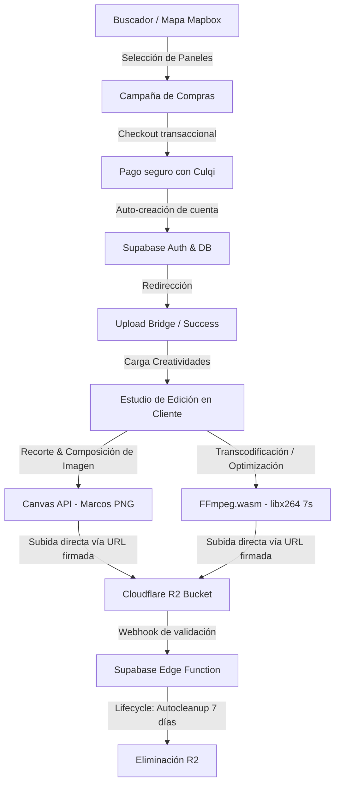

# 🌐 Mixooh — JMT Marketplace (DOOH)

[](https://nextjs.org/)
[](https://www.typescriptlang.org/)
[](https://tailwindcss.com/)
[](https://supabase.com/)
[](https://www.mapbox.com/)
[](https://ffmpeg.org/)
[](https://pnpm.io/)

Mixooh es una plataforma marketplace premium de última generación diseñada para la compra de publicidad **DOOH (Digital Out Of Home)**. Permite a los anunciantes geolocalizar pantallas publicitarias físicas, seleccionarlas mediante un mapa interactivo de alto rendimiento, realizar compras instantáneas y personalizar sus creatividades de imagen o video directamente desde el navegador de manera segura y eficiente.

---

## 🗺️ Arquitectura General del Sistema

El siguiente diagrama ilustra el flujo transaccional y la sincronización de creatividades desde la búsqueda del panel hasta el despliegue publicitario:



---

## 🚀 Características Principales

### 1. Mapa Interactivo de Alto Rendimiento (Mapbox GL JS)
*   **Visualización Geoespacial**: Renderizado en tiempo real de cientos de estructuras publicitarias físicas usando **Mapbox GL JS** y **React Map GL**.
*   **Filtros Dinámicos**: Filtros avanzados en caliente por tipo de soporte (Digital/Tradicional), precio diario, distrito e impactos de audiencia estimados.
*   **Caché Bounding Box de Dos Capas (`bboxCache`)**:
    *   **Capa 1 (Memoria)**: Respuestas instantáneas y sin latencia al hacer paneos y zooms en el mapa durante la sesión activa.
    *   **Capa 2 (localStorage)**: Persistencia automática a través de recargas de página con un tiempo de vida (**TTL de 5 minutos**).
    *   **Optimización Geográfica**: Las coordenadas del Bounding Box se redondean a **3 decimales (~111 metros de precisión)**. Esto absorbe micropaneos del mapa y evita realizar peticiones redundantes a la base de datos para áreas idénticas.

### 2. Estudio de Creación de Contenido en el Cliente
Para evitar la sobrecarga y los altos costos de procesamiento de video en el servidor, **Mixooh** realiza todo el procesamiento multimedia en el dispositivo del usuario:

*   **Editor de Recorte de Imágenes**: Integración fluida con `react-easy-crop` y **Canvas API** nativo para recortar, ajustar al formato horizontal del panel (relación 16:9) y superponer marcos PNG corporativos dinámicos de forma instantánea.
*   **Transcodificación de Video con FFmpeg.wasm**:
    *   Uso de un **FFmpeg Singleton** que inicializa los binarios de WebAssembly una sola vez y los reutiliza.
    *   Los binarios de WebAssembly (`ffmpeg-core.js`, `ffmpeg-core.wasm` y el worker) se sirven estáticamente en `/public/ffmpeg/` para eludir las limitaciones de imports dinámicos de Next.js Turbopack.
    *   Transcodifica cualquier video subido al codec estándar **H.264 (`libx264`)**, audio **AAC**, formato de píxel **yuv420p**, y duración fija de **7 segundos**.
    *   Aplica el flag de optimización `-movflags +faststart` para mover los metadatos al inicio del archivo, permitiendo que el video se reproduzca por streaming instantáneo sin esperar a descargarse por completo.
*   **Analizador de Video Nativo (`videoAnalyzer`)**:
    *   Utiliza el decodificador multimedia del elemento `<video>` de HTML5 en memoria para detectar las dimensiones, la duración exacta y la relación de aspecto del video del usuario en milisegundos sin coste computacional.

### 3. Modelo de Seguridad Endurecido (Supabase)
La base de datos PostgreSQL de **Supabase** cuenta con políticas y estructuras de seguridad avanzadas:
*   **Row-Level Security (RLS)**: Las tablas del sistema, incluyendo `orders`, restringen la lectura y escritura. Solo usuarios con sesión válida pueden insertar registros asignados a su propio `user_id` (`auth.uid() = user_id`).
*   **Funciones Seguras**: Las funciones trigger del sistema (`handle_new_user`, `handle_updated_at`, `sync_user_profile`) están configuradas rigurosamente con **`SECURITY INVOKER`** y un **`search_path` explícito y vacío** (`SET search_path = ''`) para evitar ataques de inyección de esquemas (schema-injection).
*   **Restricciones de Storage**: El bucket de almacenamiento de creatividades (`campaign_videos`) tiene deshabilitado el acceso público inseguro general; solo se permiten lecturas mediante políticas que restringen el patrón de ruta seguro `/campaign-videos/%`.

### 4. Arquitectura de Resiliencia (Error Boundaries Modulares)
Para evitar pantallas en blanco por fallos en servicios de terceros o caídas del navegador, se implementó un sistema de tolerancia a fallos en tres niveles:
1.  **`ErrorBoundary` (Base)**: Intercepta fallos generales y proporciona una interfaz premium con micro-animaciones, visualización colapsable de trazas técnicas para depuración y un botón de reintento.
2.  **`MapErrorBoundary` (Especializado)**: Aísla el mapa de Mapbox GL JS. Si falla la inicialización de WebGL o hay problemas de red con los servidores de Mapbox, renderiza una interfaz de reintento sin afectar al resto del split-view.
3.  **`UploadErrorBoundary` (Por Pasos)**: Envuelve individualmente las zonas de carga, el recortador de fotos y el selector de marcos. Si falla el Canvas en un recorte, el usuario puede retroceder o reintentar el paso actual sin perder el progreso ni la información de su orden.

---

## 📂 Estructura del Repositorio

```markdown
/
├── public/                 # Archivos estáticos
│   ├── assets/             # Logos, marcos e imágenes fijas
│   └── ffmpeg/             # Binarios estáticos de FFmpeg.wasm (evita conflictos de compilación)
├── src/
│   ├── app/                # Next.js App Router (Rutas de la Plataforma)
│   │   ├── (auth)/         # Registro, Login y Recuperación de cuenta
│   │   ├── (marketplace)/  
│   │   │   ├── page.tsx    # Home: Búsqueda geográfica principal
│   │   │   └── map/        # Split-View interactivo (Lista a la izq, Mapbox a la der)
│   │   ├── checkout/       # Formulario transaccional y pagos con Culqi
│   │   ├── api/            # Rutas de API (URLs firmadas, integración con R2)
│   │   └── order-success/  # Upload Bridge para recortar y subir multimedia tras compra
│   ├── components/         # Componentes modulares de interfaz
│   │   ├── ui/             # Componentes primitivos (Botones, Inputs, ErrorBoundary)
│   │   ├── map/            # Capa del mapa interactivo y MapErrorBoundary
│   │   └── upload/         # Dropzones, editores de recorte y boundaries de carga
│   ├── hooks/              # Custom hooks (geolocalización, estado local)
│   ├── lib/                # Librerías y utilidades core
│   │   ├── supabase/       # Clientes Supabase y utilidades
│   │   ├── bboxCache.ts    # Cache de geolocalización de dos capas (3dp precision)
│   │   ├── ffmpegClient.ts # Procesamiento e inicialización de FFmpeg.wasm
│   │   ├── imageComposer.ts# Composición Canvas 2D de fotos y marcos PNG
│   │   └── videoAnalyzer.ts# Extracción nativa de metadata de video
│   ├── store/              # Stores globales de Zustand (Campaña, ui)
│   └── types/              # Definición de tipos estrictos TypeScript
├── tailwind.config.ts      # Configuración de diseño y tokens visuales de Tailwind
├── tsconfig.json           # Configuración estricta de compilación TypeScript
└── package.json            # Scripts y dependencias administradas con pnpm
```

---

## 🛠️ Guía de Desarrollo Local

### Requisitos Previos
*   **Node.js**: Versión 18 o superior recomendada.
*   **pnpm**: Administrador de paquetes obligatorio para este repositorio.

### 1. Instalación de Dependencias
Este repositorio utiliza **pnpm** de forma obligatoria para garantizar la resolución eficiente de dependencias y evitar duplicados en disco.
```bash
pnpm install
```

### 2. Configuración de Variables de Entorno
Crea un archivo `.env.local` en la raíz del proyecto y completa las siguientes variables con tus credenciales de desarrollo:
```env
NEXT_PUBLIC_SUPABASE_URL=tu-url-de-supabase
NEXT_PUBLIC_SUPABASE_ANON_KEY=tu-anon-key-de-supabase
NEXT_PUBLIC_MAPBOX_ACCESS_TOKEN=tu-token-de-mapbox
NEXT_PUBLIC_CULQI_PUBLIC_KEY=tu-public-key-de-culqi
CLOUDFLARE_R2_ACCESS_KEY_ID=tu-key-id-de-r2
CLOUDFLARE_R2_SECRET_ACCESS_KEY=tu-secret-key-de-r2
CLOUDFLARE_R2_BUCKET_NAME=tu-bucket-de-r2
```

### 3. Servidor de Desarrollo
Inicia el entorno de ejecución en modo de desarrollo local:
```bash
pnpm dev
```
La aplicación estará disponible en `http://localhost:3000`.

### 4. Validación del Código y Tipos
Para compilar y verificar que el código no tenga advertencias ni errores de TypeScript o ESLint:
```bash
pnpm tsc --noEmit
pnpm lint
```

---

## 🤝 Principios de Desarrollo del Equipo
1.  **KISS (Keep It Simple, Stupid)**: Priorizar código legible y estructurado. Desacoplar lógica compleja de las rutas y componentes de presentación.
2.  **Server-First**: Aprovechar los React Server Components siempre que sea posible. Declarar `"use client"` únicamente en componentes que requieran interactividad o estados del cliente.
3.  **Strict TypeScript**: Prohibido el uso de `any`. Toda entidad (Panel, Booking, Cliente, Orden) debe estar completamente tipada en `src/types/`.
4.  **Alineación de Estilos**: Uso estricto de los tokens de Tailwind y clases de Shadcn para mantener una estética premium y responsiva en dispositivos móviles y de escritorio.
